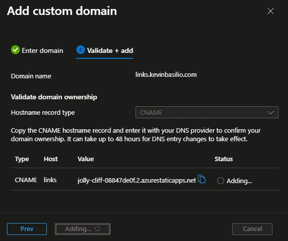

# MyUrls

This project was generated using [Angular CLI](https://github.com/angular/angular-cli) version 19.0.5.

## Config subdomain Azure Static Web App

1. Tener un proyecto con el dominio principal configurado en un Static Web App.
2. Crear un nuevo Static Web App, para el nuevo proyecto que será el subdomain de otro.
3. Añades un custom domain dentro del nuevo proyecto (SWA), en domain name pones: subdomain.mipagina.com (ejm: links.kevinbasilio.com).
4. Te pedirá que crees un CNAME, copias el valor que te dá.
5. En configuracion del dominio principal (ejm: kevinbasilio.com) en Namecheap, creas un CNAME y pones en Host tu subdominio(ejm: links) y en value pegas el valor copiado y guardas los valores.
6. En Azure pones "Add" y simplemente esperas.

 

